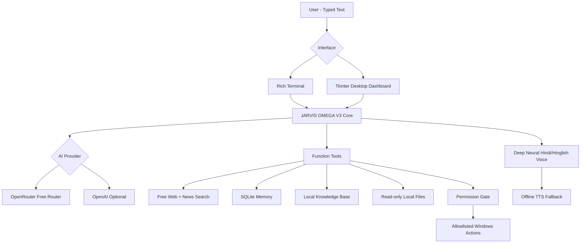

# JARVIS AI OMEGA V3

> **A typed-input, spoken-reply personal AI agent created by Adib Azam — now with free web search, persistent knowledge, tool fallback, a desktop dashboard, and a deeper Indian neural voice.**


JARVIS AI OMEGA V3 is a public personal-AI project focused on **powerful typed interaction with spoken replies**. It combines an OpenRouter free-model testing mode, optional OpenAI mode, multi-step tools, free public web/news search, persistent local memory, a local document knowledge base, permission-gated Windows actions, a terminal interface, and an optional futuristic desktop chat UI.

There is **no microphone or wake-word input** in this release. You type; JARVIS reasons, uses approved tools when needed, displays the answer, and speaks it.

## What V3 adds

- **Free public web search** using the DDGS metasearch library
- **Recent news search** and webpage text extraction
- **Persistent local knowledge base**: index safe text/code files, then ask JARVIS about them later
- **Chat export** to Markdown
- **Chat history + memory/knowledge statistics**
- **OpenRouter tool-support fallback** so free-router model changes are less likely to kill the chat loop
- **Friendlier provider errors** for key, rate-limit, model and timeout failures
- **Deeper/heavier Indian neural voice** with configurable pitch/rate/volume
- **Automatic Hindi / Hinglish / English voice selection**
- **Offline pyttsx3 fallback** if neural TTS fails
- **Runtime mute/unmute and voice-test commands**
- **Futuristic Tkinter desktop dashboard** in addition to the Rich terminal UI
- Existing permission gates, secret-path blocking and read-only local file rules remain in place

## Default free testing mode

```env
AI_PROVIDER=openrouter
OPENROUTER_MODEL=openrouter/free
```

OpenAI mode remains optional for later. In free OpenRouter mode, JARVIS can still use its own free custom web-search tools, local memory, indexed knowledge, and approved computer/file tools.

## Provider comparison

| Capability | OpenRouter free mode | OpenAI mode |
|---|---:|---:|
| General chat | ✅ | ✅ |
| Local memory | ✅ | ✅ |
| Local document knowledge base | ✅ | ✅ |
| Free custom web/news search | ✅ | ✅ |
| Local file/app tools | ✅ | ✅ |
| Deep spoken replies | ✅ | ✅ |
| Desktop dashboard | ✅ | ✅ |
| Hosted OpenAI web search | — | ✅ when enabled |
| Hosted OpenAI Code Interpreter | — | ✅ when enabled |

## Architecture



## Project structure

```text
JARVIS-AI-OMEGA/
├── jarvis/
│   ├── config.py
│   ├── core.py
│   ├── gui.py
│   ├── local_files.py
│   ├── memory.py
│   ├── permissions.py
│   ├── prompt.py
│   ├── system_tools.py
│   ├── tools.py
│   ├── ui.py
│   ├── voice.py
│   └── web_tools.py
├── tests/
├── .github/workflows/ci.yml
├── .env.example
├── desktop_app.py
├── main.py
├── self_check.py
├── setup_windows.ps1
├── run_jarvis.bat
└── requirements.txt
```

## Windows quick start

Pull the latest code and install/update dependencies:

```powershell
git pull
Set-ExecutionPolicy -Scope Process Bypass
.\setup_windows.ps1
```

If `.env` already exists, setup keeps it unchanged. For free mode, make sure it contains:

```env
AI_PROVIDER=openrouter
OPENROUTER_API_KEY=your_openrouter_key_here
OPENROUTER_MODEL=openrouter/free
ENABLE_PUBLIC_WEB_TOOLS=true
```

### Deeper voice profile

These are the new V3 defaults:

```env
VOICE_ENGINE=edge
VOICE_HINDI=hi-IN-MadhurNeural
VOICE_HINGLISH=en-IN-PrabhatNeural
VOICE_ENGLISH=en-IN-PrabhatNeural
EDGE_VOICE_RATE=-2%
EDGE_VOICE_VOLUME=+5%
EDGE_VOICE_PITCH=-18Hz
```

Your old `.env` does not need these lines because V3 has the same values as code defaults. Add them only if you want to tune the voice manually.

Validate:

```powershell
.\.venv\Scripts\python.exe self_check.py
```

### Terminal mode

```powershell
.\.venv\Scripts\python.exe main.py
```

### Desktop dashboard

```powershell
.\.venv\Scripts\python.exe desktop_app.py
```

## Power commands

| Command | Purpose |
|---|---|
| `/help` | Show all commands |
| `/status` | Provider, actual model, tools, latency and voice status |
| `/new` | Start a new chat session |
| `/web <query>` | Free public web search |
| `/news <query>` | Recent news search |
| `/remember <text>` | Save a persistent fact |
| `/recall <query>` | Search persistent facts |
| `/learn <file>` | Index an approved local text/code file into JARVIS knowledge |
| `/knowledge <query>` | Search indexed local knowledge |
| `/history [n]` | Show recent messages |
| `/export` | Export the current chat to Markdown |
| `/stats` | Show sessions/messages/facts/knowledge statistics |
| `/voice-test [hinglish|hindi|english]` | Test neural voice |
| `/mute` | Mute spoken replies |
| `/unmute` | Turn spoken replies back on |
| `/clear` | Clear terminal screen |
| `/sessions` | Show recent chat sessions |
| `/exit` | Close JARVIS |

## Examples

```text
YOU: tumhe kisne banaya?
JARVIS: Adib Azam ne mujhe banaya hai.
```

```text
/web latest Python release
/news artificial intelligence India
/learn "C:\Users\user\Documents\notes.txt"
/knowledge decorators
/export
/voice-test hinglish
```

## Safety model

OMEGA is intentionally powerful without unrestricted host control. It does **not** expose arbitrary shell execution, credential scraping, password access, file deletion, software installation, persistence, stealth control, or security-bypass tools.

Local file reads and knowledge indexing are restricted to approved roots and safe text/code file types; secret-like paths are blocked. Local actions that touch files/apps or open URLs remain permission-gated when configured. Public webpage/search content is treated as untrusted data, not as instructions to the agent.

## Security note

Never commit `.env` or API keys. If a key appears in a screenshot, stream, public issue, or public repository, revoke it and generate a new one.

## License

MIT License — see [LICENSE](LICENSE).

---

**JARVIS AI OMEGA V3 — Created by Adib Azam**
