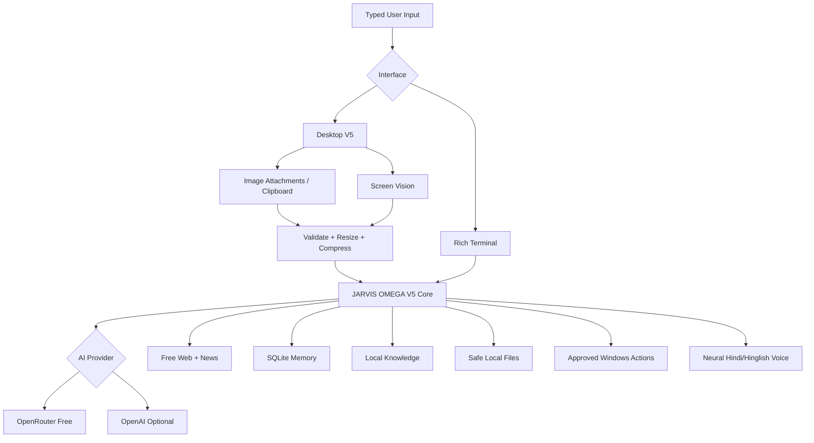

# JARVIS AI OMEGA V5

> **A typed-input, spoken-reply, multimodal personal AI agent created by Adib Azam.**


JARVIS AI OMEGA V5 is a public personal-AI project focused on **powerful typed interaction with spoken replies**. It combines free-model testing through OpenRouter, optional OpenAI mode, image upload and multimodal analysis, screen vision, free web/news search, persistent memory, a local knowledge base, permission-gated Windows tools, a Rich terminal interface, and a desktop dashboard.

**Microphone/wake-word input is intentionally not installed in this release.** You type; JARVIS reasons, can inspect attached images/screenshots, displays the answer, and speaks it.

## V5 capability stack

- OpenRouter `openrouter/free` testing mode by default
- Optional OpenAI provider mode
- Multi-step function/tool calling with free-router compatibility fallback
- **Upload 1–4 images and ask questions about them**
- **Paste an image directly from the Windows clipboard**
- Local image preview before sending
- Automatic image validation, resize, and JPEG compression before provider upload
- Permission-gated Screen Vision for the current desktop
- Free public web search, recent news search, and webpage extraction
- Persistent SQLite chat sessions and long-term facts
- Local knowledge base for approved text/code files
- Chat history, Markdown export, and memory/knowledge statistics
- Safe local file search/read with secret-like path blocking
- Allowlisted Windows app and URL launching with approval
- Deep Indian neural voice with automatic Hindi/Hinglish/English selection
- Offline TTS fallback
- Runtime mute/unmute and voice test
- Friendly errors for invalid keys, rate limits, unsupported models, image modality failures, and timeouts
- Configurable AI timeout, vision timeout, retries, image limits, and image compression
- GitHub Actions CI and unit tests

## Quick update / install

Inside the cloned repository:

```powershell
git pull
Set-ExecutionPolicy -Scope Process Bypass
.\setup_windows.ps1
.\.venv\Scripts\python.exe self_check.py
```

Start the desktop dashboard:

```powershell
.\.venv\Scripts\python.exe desktop_app.py
```

Or start terminal mode:

```powershell
.\.venv\Scripts\python.exe main.py
```

## Free testing configuration

Your `.env` should contain:

```env
AI_PROVIDER=openrouter
OPENROUTER_API_KEY=your_openrouter_key_here
OPENROUTER_MODEL=openrouter/free
```

The free router can choose different free models over time, so quality, latency, tool support, and image support can vary between requests.

---

# Image upload — how to use it

V5 adds a real image-attachment workflow. This is different from **Screen Vision**:

- **UPLOAD IMAGE** = you choose an existing image file from your PC.
- **PASTE IMAGE** = JARVIS reads an image currently copied to your Windows clipboard.
- **SCREEN VISION** = JARVIS captures your current desktop after asking permission.

## Desktop GUI method

1. Start:

```powershell
.\.venv\Scripts\python.exe desktop_app.py
```

2. Click **UPLOAD IMAGE** or press **Ctrl+O**.
3. Select up to **4 images**.
4. The attachment bar shows the selected file name(s), a preview of the first image, dimensions, and size.
5. Type a question such as:

```text
Is screenshot me kya error hai aur exact fix batao.
```

6. Press **SEND**.
7. You can also leave the text box empty and press **SEND** for a general image analysis.
8. Use **CLEAR IMAGES** to remove attachments before sending.
9. Use **IMAGE HELP** inside the app for a quick usage reminder.

### Clipboard image

Copy an image or screenshot in Windows, then click **PASTE IMAGE**. JARVIS saves a local temporary copy under its data folder, attaches it, and lets you ask a question before sending it to the AI provider.

## Terminal method

Use:

```text
/image "C:\Users\user\Pictures\error.png" | isme kya problem hai aur kya karu?
```

If you omit the prompt:

```text
/image "C:\Users\user\Pictures\photo.jpg"
```

JARVIS performs a general analysis.

## Supported image types

- PNG
- JPG / JPEG
- WEBP

Default V5 limits:

```env
MAX_IMAGE_ATTACHMENTS=4
MAX_IMAGE_MB=12
IMAGE_MAX_DIMENSION=1600
IMAGE_JPEG_QUALITY=82
```

Before sending, V5 validates the image and compresses/resizes it **in memory**. This reduces large screenshot payloads and makes free-model vision requests more reliable.

## Image privacy

- Selecting an image does **not** upload it to GitHub.
- When you press SEND, the processed image is sent to your configured AI provider for analysis.
- Screen Vision asks for permission before capturing the desktop.
- Do not send passwords, recovery codes, API keys, banking details, or other secrets in screenshots/images.
- If an API key ever appears in a screenshot shared publicly, revoke it and create a new one.

## Image troubleshooting

**“Image vision support nahi kar raha”**  
The free router selected a model that cannot process images. Retry later or choose a known vision-capable model if you have access to one.

**Image request takes too long**  
V5 has a configurable vision timeout:

```env
VISION_TIMEOUT_SECONDS=75
```

**Image too large**  
Increase `MAX_IMAGE_MB` carefully, or resize the original file. The default is 12 MB per image.

---

## Screen Vision

Desktop: click **SCREEN VISION**.  
Terminal:

```text
/screen is screen me kya issue hai aur mujhe next kya karna chahiye?
```

The screenshot is locally captured only after approval, then compressed through the same V5 image pipeline before AI analysis.

## Deep Hindi / Hinglish voice

Default neural voice profile:

```env
VOICE_ENGINE=edge
VOICE_HINDI=hi-IN-MadhurNeural
VOICE_HINGLISH=en-IN-PrabhatNeural
VOICE_ENGLISH=en-IN-PrabhatNeural
EDGE_VOICE_RATE=-2%
EDGE_VOICE_VOLUME=+5%
EDGE_VOICE_PITCH=-18Hz
```

You still type all input. Spoken output can be muted at runtime.

## Reliability settings

```env
AI_TIMEOUT_SECONDS=60
VISION_TIMEOUT_SECONDS=75
API_MAX_RETRIES=2
MAX_TOOL_ROUNDS=10
HISTORY_MESSAGES=30
```

## Desktop V5 controls

- **NEW CHAT** — new session
- **UPLOAD IMAGE** — attach images from disk
- **PASTE IMAGE** — attach clipboard image
- **SCREEN VISION** — analyze current screen with permission
- **LEARN FILE** — index an approved text/code file into local knowledge
- **MUTE VOICE** — disable spoken replies
- **VOICE TEST** — test the neural Hinglish voice
- **EXPORT CHAT** — save current chat as Markdown
- **IMAGE HELP** — image-upload instructions
- **STATUS** — provider/model/tools/image/voice diagnostics

## Terminal power commands

| Command | Purpose |
|---|---|
| `/help` | Show commands |
| `/version` | Show V5 version |
| `/status` | Provider/model/tools/image/voice/latency status |
| `/new` | New chat session |
| `/image "path" | prompt` | Analyze a local image |
| `/screen [prompt]` | Capture and analyze screen with permission |
| `/web <query>` | Free public web search |
| `/news <query>` | Recent news search |
| `/remember <text>` | Store a persistent fact |
| `/recall <query>` | Recall facts |
| `/learn <file>` | Index approved text/code file |
| `/knowledge <query>` | Search indexed local knowledge |
| `/history [n]` | Show recent messages |
| `/export` | Export current chat to Markdown |
| `/stats` | Memory/knowledge statistics |
| `/voice-test [hinglish|hindi|english]` | Test speech |
| `/mute` / `/unmute` | Control spoken replies |
| `/clear` | Clear terminal |
| `/sessions` | Show sessions |
| `/exit` | Exit JARVIS |

## Architecture



## Safety model

OMEGA V5 is designed to be useful without unrestricted host control. It does **not** expose arbitrary shell execution, credential scraping, password access, file deletion, software installation, persistence, stealth control, or security-bypass tools.

Local file reads/indexing are limited to approved roots and safe text/code types; secret-like paths are blocked. Local actions remain permission-gated where configured. External webpages, files, screenshots, and image text are treated as untrusted data rather than instructions to override the assistant.

## Project structure

```text
JARVIS-AI-OMEGA/
├── jarvis/
│   ├── attachments.py
│   ├── config.py
│   ├── core.py
│   ├── gui.py
│   ├── local_files.py
│   ├── memory.py
│   ├── permissions.py
│   ├── prompt.py
│   ├── system_tools.py
│   ├── tools.py
│   ├── ui.py
│   ├── vision.py
│   ├── voice.py
│   └── web_tools.py
├── tests/
├── .github/workflows/ci.yml
├── .env.example
├── desktop_app.py
├── main.py
├── self_check.py
├── setup_windows.ps1
├── run_jarvis.bat
└── requirements.txt
```

## License

MIT License — see [LICENSE](LICENSE).

---

**JARVIS AI OMEGA V5 — Created by Adib Azam**
