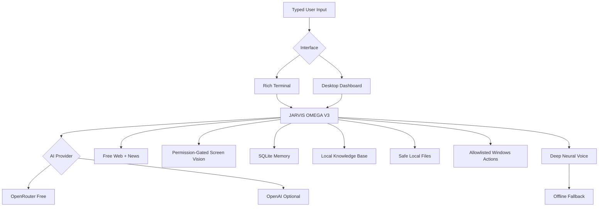

# JARVIS AI OMEGA V3

> **A typed-input, spoken-reply personal AI agent created by Adib Azam.**


JARVIS AI OMEGA V3 is a public personal-AI project focused on **powerful typed interaction with spoken replies**. It combines OpenRouter free-model testing, optional OpenAI mode, multi-step tools, free public web/news search, permission-gated screen vision, persistent memory, a local document knowledge base, safe Windows actions, a Rich terminal UI, and a futuristic desktop dashboard.

**No microphone/wake-word input is installed.** You type; JARVIS reasons, uses tools when needed, displays the answer, and speaks it.

## V3 capability stack

- OpenRouter `openrouter/free` testing mode by default
- Optional OpenAI provider mode
- Multi-step function/tool calling with free-router compatibility fallback
- Free web search, recent news search, and webpage extraction via DDGS
- Permission-gated **screen capture + AI vision analysis** in OpenRouter mode
- Persistent SQLite chat sessions and long-term facts
- Local knowledge base: index approved text/code files and search them later
- Chat history, Markdown export, and memory/knowledge statistics
- Safe local file search/read with secret-like path blocking
- Allowlisted Windows app and URL launching with approval
- Deep Indian neural voice with automatic Hindi/Hinglish/English selection
- Configurable neural voice pitch/rate/volume plus offline TTS fallback
- Runtime `/mute`, `/unmute`, and `/voice-test`
- Rich terminal UI and optional Tkinter desktop dashboard
- Friendly provider errors for invalid keys, rate limits, model availability, and timeouts
- Automated CI and unit tests

## Free mode

```env
AI_PROVIDER=openrouter
OPENROUTER_API_KEY=your_openrouter_key_here
OPENROUTER_MODEL=openrouter/free
ENABLE_PUBLIC_WEB_TOOLS=true
```

The free router can select different free models over time. JARVIS records the actual last model returned by the provider in `/status`.

## Deep voice defaults

```env
VOICE_ENGINE=edge
VOICE_HINDI=hi-IN-MadhurNeural
VOICE_HINGLISH=en-IN-PrabhatNeural
VOICE_ENGLISH=en-IN-PrabhatNeural
EDGE_VOICE_RATE=-2%
EDGE_VOICE_VOLUME=+5%
EDGE_VOICE_PITCH=-18Hz
```

These values are code defaults, so an older `.env` does not need them unless you want custom tuning.

## Architecture



## Project structure

```text
JARVIS-AI-OMEGA/
├── jarvis/
│   ├── config.py
│   ├── core.py
│   ├── gui.py
│   ├── local_files.py
│   ├── memory.py
│   ├── permissions.py
│   ├── prompt.py
│   ├── system_tools.py
│   ├── tools.py
│   ├── ui.py
│   ├── vision.py
│   ├── voice.py
│   └── web_tools.py
├── tests/
├── .github/workflows/ci.yml
├── .env.example
├── desktop_app.py
├── main.py
├── self_check.py
├── setup_windows.ps1
├── run_jarvis.bat
└── requirements.txt
```

## Windows update / install

```powershell
git pull
Set-ExecutionPolicy -Scope Process Bypass
.\setup_windows.ps1
.\.venv\Scripts\python.exe self_check.py
```

### Terminal JARVIS

```powershell
.\.venv\Scripts\python.exe main.py
```

### Desktop OMEGA dashboard

```powershell
.\.venv\Scripts\python.exe desktop_app.py
```

## Power commands

| Command | Purpose |
|---|---|
| `/help` | Show commands |
| `/status` | Provider/model/tools/voice/latency status |
| `/new` | New chat session |
| `/screen [prompt]` | Ask permission, capture screen, and analyze it with AI vision |
| `/web <query>` | Free public web search |
| `/news <query>` | Recent news search |
| `/remember <text>` | Store a persistent fact |
| `/recall <query>` | Recall facts |
| `/learn <file>` | Index an approved local text/code file |
| `/knowledge <query>` | Search indexed knowledge |
| `/history [n]` | Show recent chat messages |
| `/export` | Export current chat to Markdown |
| `/stats` | Memory/knowledge statistics |
| `/voice-test [hinglish|hindi|english]` | Test neural speech |
| `/mute` / `/unmute` | Control spoken replies |
| `/clear` | Clear terminal display |
| `/sessions` | Show recent sessions |
| `/exit` | Exit JARVIS |

## Examples

```text
YOU: tumhe kisne banaya?
JARVIS: Adib Azam ne mujhe banaya hai.
```

```text
/screen is error ko dekh ke batao kya karu
/web latest Python release
/news AI India
/learn "C:\Users\user\Documents\notes.txt"
/knowledge decorators
/export
/voice-test hinglish
```

## Safety

OMEGA V3 is powerful without unrestricted host control. It does **not** expose arbitrary shell execution, credential scraping, password access, file deletion, software installation, persistence, stealth control, or security-bypass tools.

Local file reads/indexing are limited to approved roots and safe text/code types; secret-like paths are blocked. Screen capture requires explicit approval. Public web content is treated as untrusted data, not as instructions to the agent.

## Security note

Never commit `.env` or API keys. If a key is visible in a screenshot, stream, public issue, or repository, revoke it and create a new one.

## License

MIT License — see [LICENSE](LICENSE).

---

**JARVIS AI OMEGA V3 — Created by Adib Azam**
