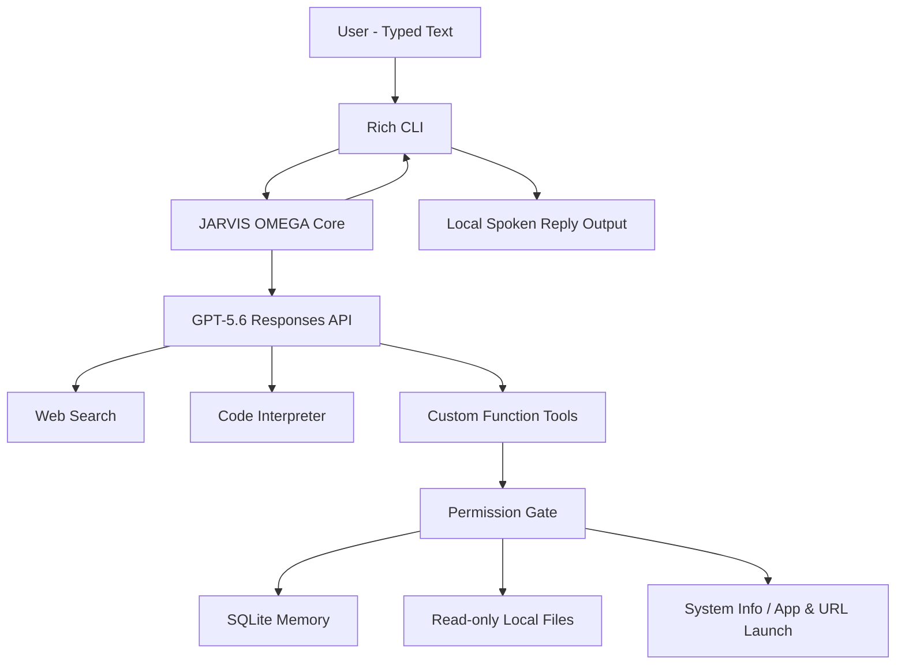

# JARVIS AI OMEGA

> **A text-first, tool-using personal AI agent created by Adib Azam — you type, JARVIS speaks.**


JARVIS AI OMEGA is a public, portfolio-grade personal AI project focused on **powerful typed interaction with spoken AI replies**. It combines OpenAI's Responses API with configurable high reasoning, web search, Code Interpreter, persistent local memory, multi-step custom tool calling, safe local file intelligence, a permission-gated Windows action layer, and local text-to-speech output.

There is **no microphone or speech-recognition input in this release**. The user types a message or command; JARVIS generates the answer, displays it, and speaks the reply.

**Creator identity:** if you ask the custom assistant who built this JARVIS project, it answers that it was created by **Adib Azam** while still correctly distinguishing the JARVIS application from its underlying AI provider.

## What makes OMEGA different

- **GPT-5.6 brain** by default
- **xhigh reasoning** configurable through `.env`
- **Multi-step agent loop**: plan → tool use → verify → answer
- **Live web search** for fresh public information
- **Hosted Code Interpreter** for calculations, Python, and data analysis
- **Persistent SQLite memory** with sessions and reusable user facts
- **Hinglish + English auto style matching**
- **Typed prompts + spoken JARVIS replies**
- **No microphone / no voice-input dependency**
- **Background speech queue** so spoken replies do not block normal chat interaction
- **Speech-friendly cleanup** so large code blocks are not read aloud verbatim
- **Safe local file intelligence** for Desktop, Documents, Downloads, and the project directory
- **Permission gate** before privacy-sensitive/local actions
- **Windows app launcher** limited to an explicit allowlist
- **No arbitrary host shell**
- **No credential extraction, file deletion, stealth control, or security bypass tools**
- **Rich terminal UI** with commands, panels, status, and local approvals
- **Automated CI** on multiple Python versions

## Architecture



## Project structure

```text
JARVIS-AI-OMEGA/
├── jarvis/
│   ├── config.py
│   ├── core.py
│   ├── local_files.py
│   ├── memory.py
│   ├── permissions.py
│   ├── prompt.py
│   ├── system_tools.py
│   ├── tools.py
│   ├── ui.py
│   └── voice.py
├── tests/
├── .github/workflows/ci.yml
├── .env.example
├── main.py
├── self_check.py
├── setup_windows.ps1
├── run_jarvis.bat
└── requirements.txt
```

## Windows quick start

Open PowerShell inside the cloned repository:

```powershell
Set-ExecutionPolicy -Scope Process Bypass
.\setup_windows.ps1
```

Then open `.env` and set:

```env
OPENAI_API_KEY=your_key_here
```

Spoken replies are enabled by default:

```env
ENABLE_VOICE_OUTPUT=true
VOICE_RATE=185
VOICE_VOLUME=1.0
```

Validate the installation:

```powershell
.\.venv\Scripts\python.exe self_check.py
```

Start JARVIS:

```powershell
.\.venv\Scripts\python.exe main.py
```

Or double-click `run_jarvis.bat`.

## How interaction works

```text
YOU: Tumhe kisne banaya?
JARVIS: Adib Azam ne mujhe banaya hai.
```

The second line is shown in the terminal **and spoken through the computer speakers**. You do not need to speak into a microphone.

## Example prompts

```text
Tumhe kisne banaya?
Explain neural networks in Hinglish like I am a CST student.
Latest AI news search karke 5 important points batao.
Calculate a 5-year SIP projection with Python.
Remember that I prefer concise Hinglish answers.
Mere Downloads me resume naam ki file search karo.
Is Python file ko read karke bugs batao.
Calculator kholo.
```

## Built-in slash commands

| Command | Purpose |
|---|---|
| `/help` | Show command list |
| `/new` | Start a new conversation session |
| `/status` | Show model, tools, voice-output and session status |
| `/remember <text>` | Store a local long-term fact |
| `/recall <query>` | Search local long-term memory |
| `/sessions` | Show recent sessions |
| `/exit` | Exit JARVIS |

## Safety model

OMEGA is intentionally powerful **without giving the model unrestricted control of the host PC**.

Local actions such as reading a file, searching local folders, opening a URL, or launching an app can require explicit confirmation. Local file reads are restricted to configured roots and safe text/code extensions. Secret-like paths are blocked. The agent does not expose arbitrary shell execution, passwords, credential scraping, deletion, installation, persistence, or security-bypass functions.

Speech in this release is **output-only**. No microphone listener or speech-recognition loop is installed.

## Configuration

`.env.example` includes:

- `OPENAI_MODEL=gpt-5.6`
- `REASONING_EFFORT=xhigh`
- `ENABLE_VOICE_OUTPUT=true`
- `VOICE_RATE=185`
- `VOICE_VOLUME=1.0`
- web search on/off
- Code Interpreter on/off
- local tools on/off
- local approval requirement
- maximum tool rounds
- memory history size
- allowed local file roots

## Roadmap

### Current release — Text + Spoken Reply Core
- [x] Advanced typed chat
- [x] Spoken AI reply output
- [x] No microphone input
- [x] Web search
- [x] Code Interpreter
- [x] Local long-term memory
- [x] Multi-tool agent loop
- [x] Permission-gated local tools
- [x] Public-ready documentation and CI

### Future releases
- [ ] Streaming text UI
- [ ] Optional desktop/web dashboard
- [ ] Document ingestion and semantic knowledge base
- [ ] Plugin/skill marketplace layer
- [ ] Calendar and email connectors
- [ ] Screen vision module
- [ ] Optional microphone / wake word / realtime voice input

## Security

Please read [SECURITY.md](SECURITY.md). Never commit your `.env` or API key.

## Contributing

Contributions are welcome. See [CONTRIBUTING.md](CONTRIBUTING.md).

## License

MIT License — see [LICENSE](LICENSE).

---

**JARVIS AI OMEGA — Created by Adib Azam**
