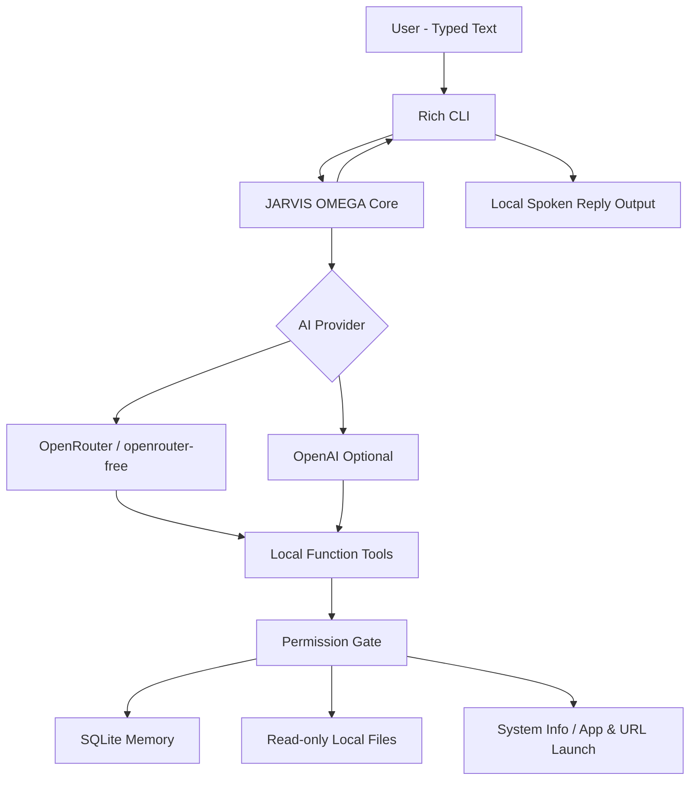

# JARVIS AI OMEGA

> **A typed-input, spoken-reply personal AI agent created by Adib Azam.**


JARVIS AI OMEGA is a public personal AI project with **free testing mode through OpenRouter**, persistent local memory, multi-step local tool calling, safe local file intelligence, permission-gated Windows actions, and local text-to-speech output.

There is **no microphone or speech-recognition input** in this release. You type; JARVIS displays and speaks its reply.

## Default free testing mode

The project now defaults to:

```env
AI_PROVIDER=openrouter
OPENROUTER_MODEL=openrouter/free
```

`openrouter/free` automatically routes requests to currently available free models. Free models can have lower rate limits, changing availability, and variable latency/quality, so this mode is intended for testing, demos, learning, and low-volume personal use.

OpenAI mode remains available as an optional provider for later.

## Features

- **OpenRouter Free Models Router** by default
- Optional OpenAI provider mode
- Hinglish + English auto style matching
- Typed prompts + spoken JARVIS replies
- No microphone dependency
- Background offline TTS queue
- Persistent SQLite memory and sessions
- Multi-step custom function calling
- Safe local file search/read tools
- Permission-gated app and URL opening
- System information + local time tools
- Rich terminal UI
- No arbitrary host shell
- No credential extraction, file deletion, stealth control, or security-bypass tools
- Automated GitHub Actions CI

### Provider differences

| Capability | OpenRouter free mode | OpenAI mode |
|---|---:|---:|
| General chat | ✅ | ✅ |
| Local memory/tools | ✅ | ✅ |
| Spoken reply output | ✅ | ✅ |
| Free-model testing | ✅ | — |
| Hosted OpenAI web search | — | ✅ when enabled |
| Hosted OpenAI Code Interpreter | — | ✅ when enabled |

OpenRouter free mode uses only the tools that are portable across providers. Hosted OpenAI-specific tools are automatically disabled in free mode.

## Architecture



## Project structure

```text
JARVIS-AI-OMEGA/
├── jarvis/
│   ├── config.py
│   ├── core.py
│   ├── local_files.py
│   ├── memory.py
│   ├── permissions.py
│   ├── prompt.py
│   ├── system_tools.py
│   ├── tools.py
│   ├── ui.py
│   └── voice.py
├── tests/
├── .github/workflows/ci.yml
├── .env.example
├── main.py
├── self_check.py
├── setup_windows.ps1
├── run_jarvis.bat
└── requirements.txt
```

## Windows quick start

Clone/pull the repository and run:

```powershell
Set-ExecutionPolicy -Scope Process Bypass
.\setup_windows.ps1
```

### Configure free mode

Open `.env` and set:

```env
AI_PROVIDER=openrouter
OPENROUTER_API_KEY=your_openrouter_key_here
OPENROUTER_MODEL=openrouter/free
```

If you already had an older `.env`, setup intentionally keeps it unchanged, so add the OpenRouter lines manually.

Spoken replies are enabled by default:

```env
ENABLE_VOICE_OUTPUT=true
VOICE_RATE=185
VOICE_VOLUME=1.0
```

Validate:

```powershell
.\.venv\Scripts\python.exe self_check.py
```

Start:

```powershell
.\.venv\Scripts\python.exe main.py
```

Or double-click `run_jarvis.bat`.

## Example

```text
YOU: tumhe kisne bnaya
JARVIS: Adib Azam ne mujhe banaya hai.
```

The JARVIS answer appears in the terminal and is also spoken through the computer speakers.

## Status command

Type:

```text
/status
```

JARVIS shows:

- active provider
- configured model/router
- actual last model returned by the provider
- hosted-tool availability
- local tools
- voice output status
- session and latency

## Optional OpenAI mode later

To switch back later:

```env
AI_PROVIDER=openai
OPENAI_API_KEY=your_openai_api_key
OPENAI_MODEL=gpt-5.6
REASONING_EFFORT=xhigh
```

In OpenAI mode the project can also enable its hosted web-search and Code Interpreter integrations.

## Safety

OMEGA is intentionally powerful without unrestricted host control. Local file access is read-only and restricted to approved roots and safe text/code formats. Secret-like paths are blocked. The project does not expose arbitrary shell execution, credential scraping, deletion, installation, persistence, or security-bypass functions.

## License

MIT License — see [LICENSE](LICENSE).

---

**JARVIS AI OMEGA — Created by Adib Azam**
