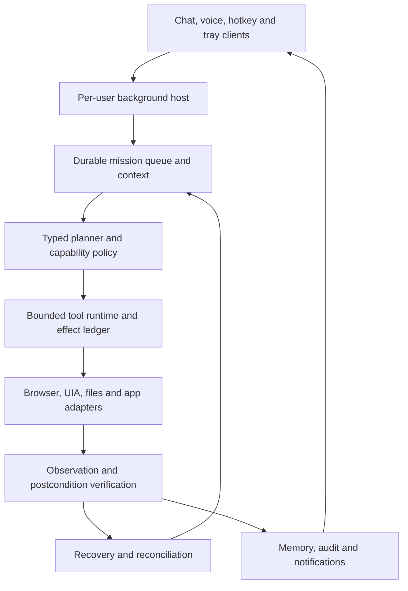

# V8 Frontier Execution Plan

Date: **2026-10-04**. Runtime baseline: [`main@83b7f34`](https://github.com/Adib0105/JARVIS-AI-OMEGA/commit/83b7f34b67c0aca444c1139cd7db700364bc554c). Documentation branch: `v8/frontier-audit-2026-09-28` / PR #24.

This is the audit-first deliverable requested by section 59 of the supplied brief. No runtime code, security policy, production data, dependency pins or release settings are changed. The 2026-09-28 audit is retained in Git history; this refresh adds direct source checks and six executable reproductions.

## First implementation batch: evidence before autonomy

Reproduce → add failing regression → small compatible fix → targeted suite → full regression → review diff → exact-commit CI. No feature is complete without integrated observable evidence.

1. V8-003: retain dispatched tool evidence on verification/progress/persistence failures and stop unsafe replay/replanning. Test with a real temporary SQLite write, not only a fake boolean.
2. V8-001/002: typed verification contracts, strict booleans and local-state readback. Preserve legitimate already-completed/idempotent behavior without calling a nonexistent row successful.
3. V8-004/005: strict scenario outcomes, matched versioned cohorts and quality-only comparison. Propagate inconclusive results to the self-development gate.
4. V8-006: harden the standalone semantic adapter; do not expose it until V8-009 passes.
5. V8-013: atomic approved file writes and collision-proof backups with fault tests.

## Implementation phases

| Phase | Deliverable | Gate |
|---|---|---|
| 1 Audit | Current source, tests, reproduced faults, gap/status register | This documentation-only update |
| 2 Core contracts | Typed plans, missions, configuration, event/action/evidence contracts, accurate capabilities | Compatibility/migration/schema tests |
| 3 Reliability | Replay repair, budgets, cancellation, resource ownership, atomic files, recovery | Fault/restart/concurrency regressions |
| 4 Security | Strict evidence, IPC/auth, data/field/origin policy, secret boundaries | Negative/abuse tests and explicit protected-path review |
| 5 Agent intelligence | Capability-aware structured planner, bounded replan and context | Grounded task corpus, no narrative-only success |
| 6 Computer/browser | UIA observations, identity/freshness, stateful forms/browser, approved file/app adapters | Real fixture Windows/browser postconditions |
| 7 Memory/RAG | Lifecycle, citations, consent/owner/expiry and quality datasets | Source deletion/change and labelled relevance/citation tests |
| 8 Coding | Inspect/patch/test/review workflow behind real isolation | Host fallback remains denied |
| 9 Evaluation | Strict outcomes, matched cohorts, 100+ corpus and gauntlet manifests | Actual expected/observed/evidence records |
| 10 Controlled improvement | Evidence-backed proposal → isolated execution → review → approved release | Immutable security core and verified rollback |
| 11 UI | Unified dark command center and truthful background/privacy indicators | Real layout/accessibility/latency evidence |
| 12 Final QA | Linux/Windows, physical voice/desktop, provider/merchant, install/update/signing | No unresolved mandatory P0/P1 or release blocker |

Phases 2–4 should begin with the first batch above rather than a rewrite. The background host must run as the logged-in user; a Windows service in session 0 must not be assumed capable of interacting with the user's desktop. Design authenticated per-user IPC and process recovery before exposing a command endpoint.

## Proposed architecture

Preserve core.py/core_v7.py public interfaces, SQLite data and current provider adapters. No second competing mission engine. Add migrations with backups and versioned schemas; do not rename/delete production tables for a clean design.

## Files proposed for modification

First batch: `jarvis/agent/orchestrator.py`, `jarvis/agent/verification.py`, `jarvis/agent/event_safety.py`, `jarvis/agent/effects.py`, `jarvis/memory.py`, `jarvis/tools.py`, `jarvis/evaluation/benchmark.py`, `jarvis/self_development/benchmark.py`, `jarvis/computer_use/action_engine.py`, `jarvis/coding_tools.py` and focused regression files under `tests/` / `tests/evaluation/`.

Later: `jarvis/agent/mission.py`, `mission_store.py`, `budget.py`, `config.py`, `capability_registry.py`, `desktop_app.py`, `background_ui.py`, `wake_service.py`, `microphone.py`, `computer_use/`, `storage/`, UI modules and new background host/IPC/queue/event adapters. Final paths depend on reviewed contracts; a name in this list is not an implemented feature.

## Protected operations requiring explicit review/authorization

Never silently modify `.env`, live `data/` or profile databases, OAuth tokens, remembered sessions, merchant/SMTP secrets, signing keys or external accounts. Do not enable generated host execution, weaken self-development/permission/secret policy, switch `publish-release` on, apply branch administration settings, merge/release production changes, install an autostart service on the user's PC or alter their system settings as part of this audit. Ordinary source fixes on an isolated review branch are distinct from these production effects.

## Expected verification

- Temporary-database reproductions become regression tests with explicit postconditions; injected post-dispatch failure cannot create a duplicate effect.
- Preserve Linux 3.11–3.14, isolated service and Windows gates; run targeted tests after each logical fix and full regressions before review.
- Record exact commit, environment, scenario version, artifact hash and independent outcome evidence. Keep mock, hosted Windows and physical-device results separately labelled.
- Require real target-PC microphone/speaker/Bluetooth/sleep/foreground-focus trials, 100 wake attempts per declared condition and eight-hour background soak.
- Declare performance thresholds before measuring; collect startup/voice/action p50/p95 and idle CPU/RAM. No invented intelligence or success score.
- Verify HTTPS test deployment, provider auth/recovery, SMTP and Stripe test-mode lifecycle with authorized test credentials; no live charge or message is part of this audit.

## Rollback

This audit is documentation-only and can be reverted without runtime or database changes. Future patches must be separate reviewable commits with versioned migrations and a tested data-preserving rollback. Do not use destructive resets or discard unrelated user changes.
